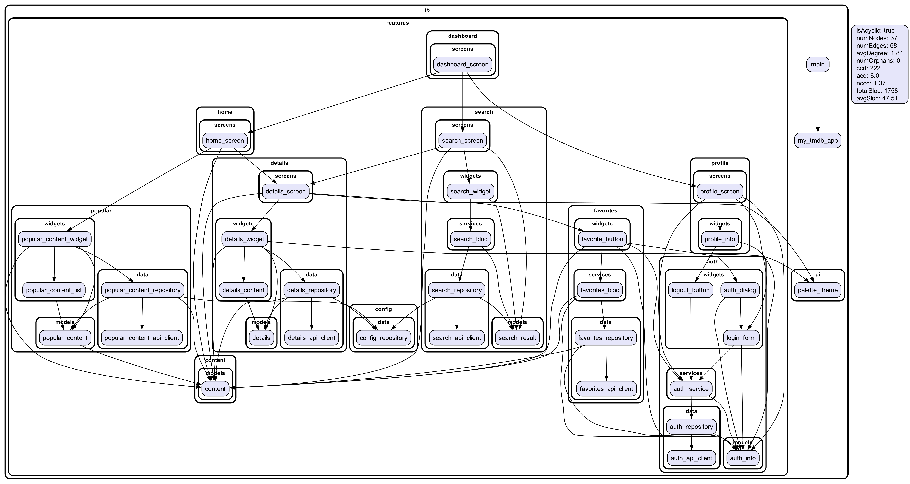

# MyTMDB

This is a "crowdsourced" Flutter tutorial project, mainly showcasing an architecture for a full-fledged app, but can be used to demonstrate other Flutter-specific approaches.

The main architecture principle for this app is KISS: removing abstractions that only exist "because this is best practice".

Being a code reviewer, consultant and mentor on a regular basis, I often see these overengineering practices come into Flutter apps architectures – so this sample project is my attempt to vote against this cargo cult of "enterprise-style" architecture, and show that even the simple architecture can be scalable.

The app itself is the client to [TMDB API][1]: some abstract "movie" app. There are no exact specifications and we can add as many features as possible.

Why "crowdsourced"? You're free to participate in this project in any form: ask questions if something is unclear; argue if the architecture is too simple and too complex (but get ready to prove your point of view); request some features to implement to see how (or if) it can be implemented using this KISS approach. And, of course, create PRs and participate in discussions.

## Modular architecture

## Attribution

This product uses the TMDB API but is not endorsed or certified by TMDB.

[1]: https://developers.themoviedb.org/3/getting-started/introduction
